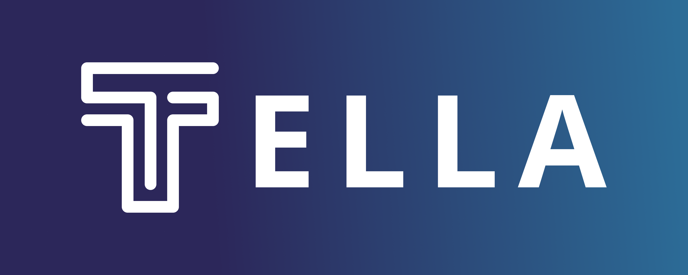
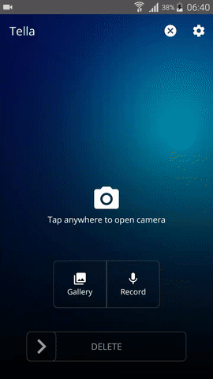
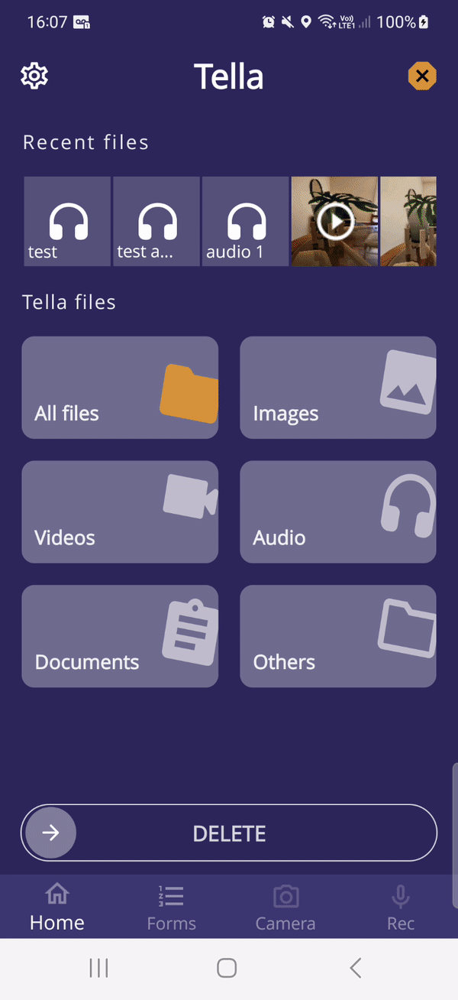

## Table of Contents

1. [Overview](#overview)

2. [Why Tella?](#why-tella)

3. [Detailed list of features](#features)

4. [How to get Tella and start using it?](#use-tella)

5. [Tech & frameworks used](#tech-used)

6. [Contributing to the code](#contributing)

7. [Translating the app](#translating)

8. [Contact us](#contact)

## Overview 

Tella is a documentation app for Android. In challenging environments--with limited or no internet connectivity or in the face of repression--Tella makes it easier and safer to document events, whether that’s violence, human rights violations, corruption, or electoral fraud.

|  |  |  |
|:---:|:---:|:---:|
| [Tella camouflaged as a calculator](https://tella-app.org/features#camouflage) | [Taking and encrypting a video](https://tella-app.org/features#encryption) | [Sending data to a server](https://tella-app.org/for-organizations) |

Tella:
- encrypts photo, video, audio and PDF files in a separate gallery so it cannot be accessed from the phone's regular gallery or file explorer.
- hides itself by changing its name and icon in the list of apps or behind a working calculator.
- captures metadata when taking photos, videos, and audio recordings to verify the origin of the files.
- allows users to quickly delete all files in Tella's encrypted vault.
- enables users working with a group or organization to collect and send data to a server without relying on third-party apps or servers.

You can watch a [short video demonstrating Tella's main features here](https://www.youtube.com/watch?v=aJIyWESxM_o&t=1s)

## Why Tella? 

Across the world, journalists and human rights defenders are facing increasing levels of physical repression, with mobile devices searched or seized at border crossings and airports, checkpoints, in the street, or in targeted raids. At the same time, digital surveillance and censorship threaten the flow of information out of repressive areas, particularly on violence, human rights abuse, or corruption. 

Tella's goal is to protect at-risk individuals and groups--advocates, journalists, human rights defenders--from repressive surveillance, whether physical or digital. Tella aims to provide a highly usable solution, accessible to all with minimal or no training, to collect, safeguard, and communicate sensitive information in highly repressive environments. 

Tella has three main objectives:
- Protecting users who engage in documentation from physical and digital repression
- Protecting the data they collect from censorship, tampering, interception, and destruction
- Empowering individuals and groups to easily, quickly, and effectively collect data and produce high quality documentation that can be used for research, advocacy, or transitional justice

Tella is used by:
- Activists, organizers and human rights defenders to safely document events in their communities, produce reliable and verifiable evidence, and store data encrypted on their mobile devices.
- Media, professional reporters and citizen journalists to store sensitive media files encrypted as they travel, particularly as they cross borders.
- Civil society professionals and humanitarian workers to conduct interviews and collect data in poorly connected environments or in conflict areas.
- Electoral observation and monitoring organizations to monitor elections from inside and outside polling stations in real time and expose electoral fraud.
- Research institutions and international organizations to conduct research, interviews or surveys in challenging environments, particularly in conflict areas.

You can read usage stories [here](https://tella-app.org/user-stories).

## Detailed list of features 

A detailed list of all Tella features can be found here: https://tella-app.org/features. 

## How to get Tella and start using it? 

Tella is currently available on Android, iOS and the F-Droid store. We also share the Tella .apk to be installed manually. [Here there is more information](https://tella-app.org/faq#general). A step-by-step guide on how to use Tella can be found [here](https://tella-app.org/get-started-android).

## Tech & frameworks used 

This software uses the following open source packages:
- [SQLCipher](https://github.com/sqlcipher/sqlcipher) for our encrypted database.
- [CacheWord](https://guardianproject.info/code/cacheword/) for passphrase caching and management.
- [ODK JavaRosa](https://github.com/getodk/javarosa) to work with XForms.
- [CameraView](https://github.com/natario1/CameraView), [ExoPlayer](https://github.com/google/ExoPlayer), [RxJava](https://github.com/ReactiveX/RxJava), [OkHttp](https://github.com/square/okhttp), [Retrofit](https://github.com/square/retrofit), [PermissionDispatcher](https://github.com/permissions-dispatcher/PermissionsDispatcher), [PatternLock](https://github.com/zhanghai/PatternLock) and a lot of other excellent [libraries](https://github.com/Horizontal-org/Tella-Android/blob/master/mobile/build.gradle) helping all of us in Android application development.

## Contributing to the code 

**Step 1: Get familiar with Tella.** The best way is simply to download Tella play with it and try the different features, or [read our documentation here](https://docs.tella-app.org).

**Step 2: Find an issue to work on.** Please find an issue that you would like to take on and comment to assign yourself if no one else has done so already. [All issues with the label `good first issue`](https://github.com/Horizontal-org/Tella-Android/issues?q=is%3Aopen+is%3Aissue+label%3A%22good+first+issue%22) are good ways to get started. Also, feel free to ask questions in the issues, and we will get back to you ASAP!

**Step 3: Fork the repo** Click the "fork" button in the upper right of the Github repo page. A fork is a copy of the repository that allows you to freely explore & experiment without changing the original project. You can learn more about forking a repo [in this article](https://help.github.com/articles/fork-a-repo/).

**Step 4: Create a branch** Create a new branch for your issue from `develop` branch. You can name it anything, but we encourage you to use the format `XXX-brief-description-of-feature` where XXX is the issue number.

**Step 5: Code away!** Feel free to discuss any questions on the issues as needed, and we will get back to you! Don't forget to write some tests to verify your code. Commit your changes locally, using descriptive messages and please be sure to note the parts of the app that are affected by this commit.

**Step 6: Pushing your branch and creating a pull request** Push your branch up and create a pull request. Please indicate which issue your PR addresses in the title.

## Translating the app 
Tella is currently available in [17 languages](https://tella-app.org/translating-tella). We are always looking to translate Tella into more languages. 

If you are interested in adding a new language, or if you noticed a mistake or a missing translation, you can join [follow our contributing guidelines](https://tella-app.org/translating-tella/#how-do-i-become-a-translator). 

## Contact us 
We love hearing from users, designers, and developers!

We host monthly [community meetings](https://tella-app.org/community-meetings) and we offer different ways to [contact-us](https://tella-app.org/contact-us). 

 If you have any question, ideas or suggestions on how we can improve or what new features we should add, or if you need support deploying Tella, don't hesitate to reach out!

