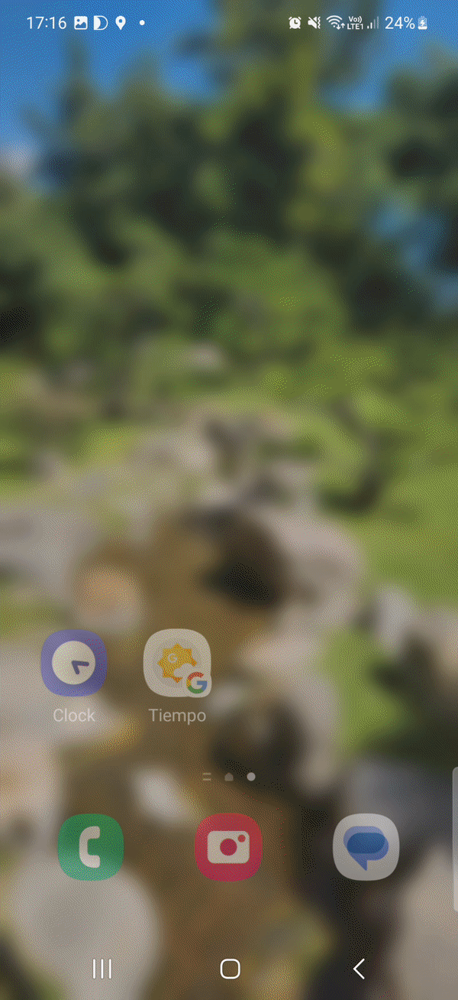
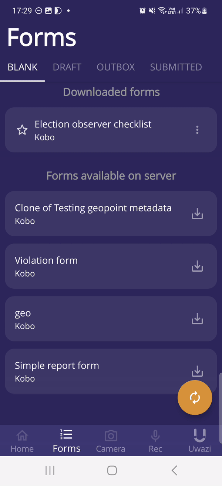

## Table of Contents

1. [Overview](#about)

2. [Why Tella?](#why-tella)

3. [Detailed list of features](#features)

4. [How to get Tella and start using it?](#use-tella)

5. [Tech & frameworks used](#tech-used)

6. [Contributing to the code](#contributing)

7. [Translating the app](#translating)

8. [Contact us](#contact)

## About Tella 

In challenging environments, with limited or no internet connectivity or in the face of repression, Tella is an app that makes it easier and safer to document human rights violations and collect data. Tella is available Android and iOS. 

More information about how to get Tella --including user guides-- can be found on our [documentation platfrom] (https://docs.tella-app.org/).

|   |  |  |
|:---:|:---:|:---:|
| Tella camouflaged as a calculator | Taking and encrypting a photo | Collecting data |

Tella:
- encrypts photo, video, and audio files in a separate gallery so it cannot be accessed from the phone's regular gallery or file explorer
- hides itself by changing its name and icon in the list of apps
- captures metadata when taking photos, videos, and audio recordings to verify the origin of the files
- allows users to quickly delete all files in Tella's encrypted Gallery
- enables users working with a group or organization to collect and send data to a server without relying on third-party apps or servers

## Why Tella? 

If you are an activist, journalist, human rights defender, or anyone who engages in documentation of injustice, you can use Tella to:

Protect yourself from physical and digital repression while collecting and storing sensitive information.
Protect the data you collect from censorship, tampering, interception, and destruction.
Easily produce high quality documentation that can be used for research, advocacy, or transitional justice.

## Detailed list of features 

A detailed list of features for both Tella Android and iOS can be found [on the documentation] (https://docs.tella-app.org/).

## How to get Tella and start using it? 

### Tella for Android
Tella for Android can be downloaded:
- directly from the [Google Play Store](https://play.google.com/store/apps/details?id=org.hzontal.tella)
- from [this folder](https://web.tresorit.com/l/7737s#WKoGVN82C0lQK8KSL30CuA), as an APK, to be installed manually

### Tella for iPhone
Tella for iOS can downloaded [from the App Store](https://apps.apple.com/us/app/tella-document-protect/id1598152580).

## Tech & frameworks used 

This software uses the following open source packages:
- [SQLCipher](https://github.com/sqlcipher/sqlcipher) for our encrypted database.
- [CacheWord](https://guardianproject.info/code/cacheword/) for passphrase caching and management.
- [ODK JavaRosa](https://github.com/getodk/javarosa) to work with XForms.
- [CameraView](https://github.com/natario1/CameraView), [ExoPlayer](https://github.com/google/ExoPlayer), [RxJava](https://github.com/ReactiveX/RxJava), [OkHttp](https://github.com/square/okhttp), [Retrofit](https://github.com/square/retrofit), [PermissionDispatcher](https://github.com/permissions-dispatcher/PermissionsDispatcher), [PatternLock](https://github.com/zhanghai/PatternLock) and a lot of other excellent [libraries](https://github.com/Horizontal-org/Tella-Android/blob/master/mobile/build.gradle) helping all of us in Android application development.

## Contributing to the code 

**Step 1: Get familiar with Tella.** The best way is simply to download Tella play with it and try the different features, or [read our documentation here](https://docs.tella-app.org).

**Step 2: Find an issue to work on.** Please find an issue that you would like to take on and comment to assign yourself if no one else has done so already. [All issues with the label `good first issue`](https://github.com/Horizontal-org/Tella-Android/issues?q=is%3Aopen+is%3Aissue+label%3A%22good+first+issue%22) are good ways to get started. Also, feel free to ask questions in the issues, and we will get back to you ASAP!

**Step 3: Fork the repo** Click the "fork" button in the upper right of the Github repo page. A fork is a copy of the repository that allows you to freely explore & experiment without changing the original project. You can learn more about forking a repo [in this article](https://help.github.com/articles/fork-a-repo/).

**Step 4: Create a branch** Create a new branch for your issue from `develop` branch. You can name it anything, but we encourage you to use the format `XXX-brief-description-of-feature` where XXX is the issue number.

**Step 5: Code away!** Feel free to discuss any questions on the issues as needed, and we will get back to you! Don't forget to write some tests to verify your code. Commit your changes locally, using descriptive messages and please be sure to note the parts of the app that are affected by this commit.

**Step 6: Pushing your branch and creating a pull request** Push your branch up and create a pull request. Please indicate which issue your PR addresses in the title.

## Translating the app 
Language accessibility is one of our priority, so we work hard to make Tella available in languages spoken by communities who express the need for Tella.

Currently Tella is available in:
- Arabic
- Belarusian
- Burmese
- English
- Indonesian
- Jingpho
- Kannada
- Karen Sgaw
- Malayalam
- Portuguese
- Russian
- Spanish (Latin America)
- Tamil

We, however, don't always have the capacity or resources to keep all translations up to date.  If you wish to contribute to the translation of Tella, you can join [the Tella project on Lokalise](https://app.lokalise.com/public/9394139661a3d89da6fa91.77098206/) and contribute from there. 

If you want us to add a new language, send us an email.

## Contact us 
We love hearing from users, designers, and developers! If you have any question, ideas or suggestions on how we can improve or what new features we should add, or if you need support deploying Tella, don't hesitate to reach out!

You email us at contact@tella-app.org. 

